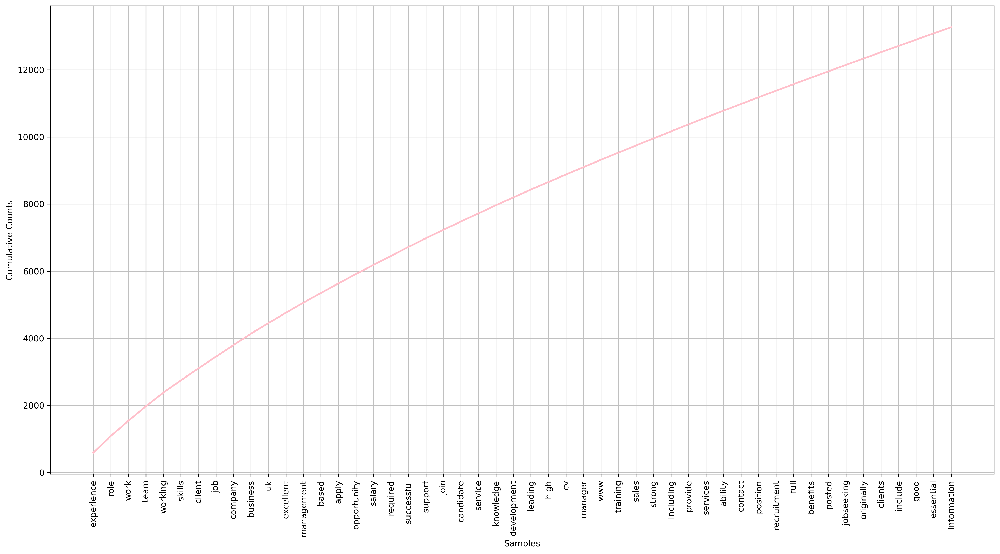
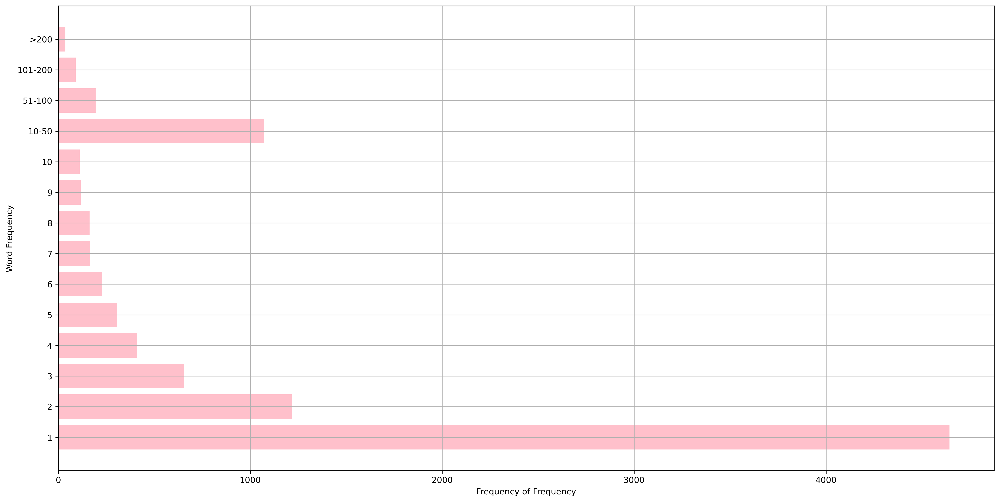

# Natural Language Processing Job Advertisement
Explore a Movie review data set, and pre-process the text review corpus. Use the pre-processed text reviews to generate data features and build a sentiment analysis model to predict sentiment of reviews.

<a href="https://youtu.be/nFVLoW-K7UQ" target="blank">Demo on YouTube </a> 

## Project Purpose
+ Pre-process natural language text data to generate effective feature representations;
+ Document and maintain an editable transcript of the data pre-processing pipeline for professional reporting.

## Data Overview
+ A small collection of job advertisement documents (around 776 jobs) inside the `data` folder.
+ Inside the data folder, there are four different sub-folders: Accounting_Finance, Engineering, Healthcare_Nursing, and Sales, representing a job category.
+ The job advertisement text documents of a particular category are in the corresponding sub-folder.
+ Each job advertisement document is a txt file named `Job_<ID>.txt`. It contains the title, the webindex (some will also have information on the company name, some might not), and the full description of the job advertisement.

# Cumulative frequency plot for most common 50 words

# Word frequency distribution 

